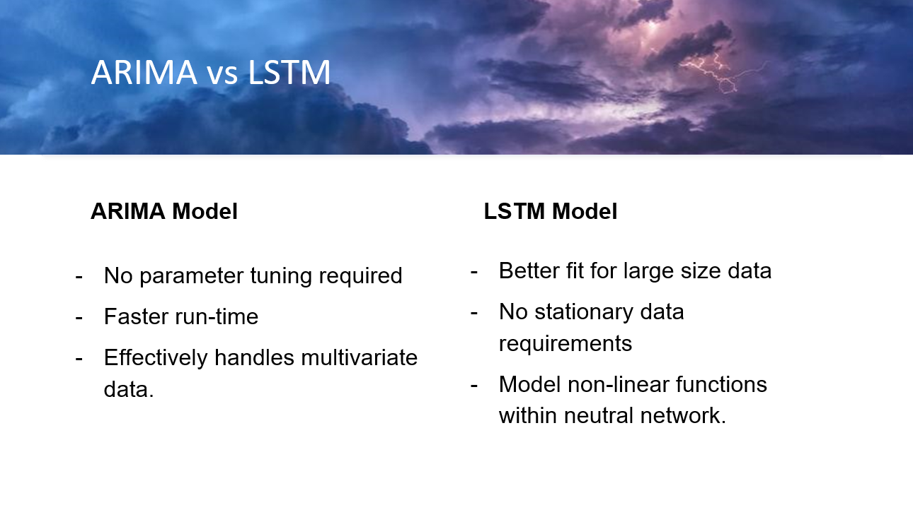
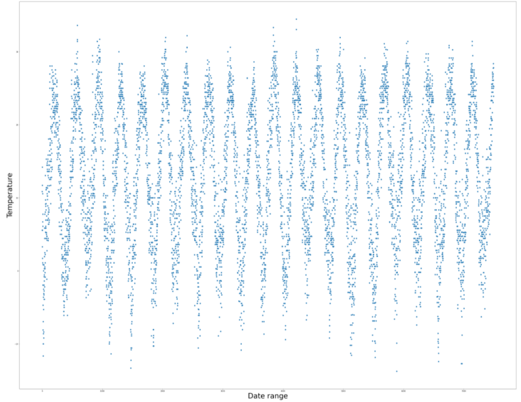
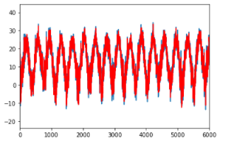
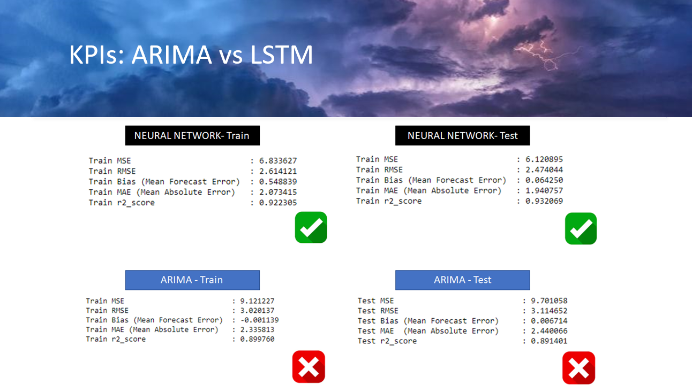

# 19_NYC_Weather_Forecast_Machine_Learning_Project 

In this assignment, we are using machine learning to predict the weather forecasts for New York City. 

  

## **1. Authors**

This project was created and authored by:
* **Anna Wrobel**
* **Latyr Thiao**
* **Leah Lindy**
* **Lujane Abdelgadir**
* **Prajakta Kalvankar**
* **Stephen Zhang**

## **2. Requirements / Specifications**

The [business & technical requirements](01_Instructions_Final_Project.pdf) that must be met by the solution.

## **3. Prerequisites**

The mandatory steps to be taken to make the code work smoothly.

### **3.1 License & Key**

The following key will be required:
* not applicable

### **3.2 Installing**

The assumption here is that your computer is running on Windows 10.
Feel free to adjust if you are using a Mac OS or any other operating system.

What software do you need and how to install them?

* Anaconda
* Required modules: [See details](Python_Modules.txt)
* Jupyter Notebook
* Tableau (https://www.tableau.com/trial/download-tableau)

## **4. Tools & Coding Languages**

The following tools and coding languages were used:

* Python
* Pandas
* Jupyter Notebook
* Tableau

## **5. Data Source(s)**

* Data:
  National Oceanic and Atmospheric Administration (NOAA): https://www.ncdc.noaa.gov/cdo-web/

* Reference Code:
  * ARIMA: 
      * https://machinelearningmastery.com/arima-for-time-series-forecasting-with-python/
      * https://machinelearningmastery.com/time-series-data-stationary-python/

  * Neural Network (LSTM): 
      * https://stackabuse.com/using-machine-learning-to-predict-the-weather-part-1, 2, 3
      * https://www.wunderground.com/
      * https://pdfs.semanticscholar.org/2761/8afb77c5081d942640333528943149a66edd.pdf

## **6. Run the code**

### **Step 1: The code is located here**

The code is available as follows:
* [Jupyter Notebook](Analysis.ipynb)

We used 2 separate models: 
* ARIMA (Auto Regressive Moving Average)
* LSTM (Long Short-Term Memory)

Each model was split in this manner:
*  80% Train data
*  20% Test data

### **Step 2: Extract all files & run the code**

* [Jupyter Notebook](Analysis.ipynb)

## **7. User Acceptance Testing**

Acceptence criteria:  
The [business & technical requirements](01_Instructions_Final_Project.pdf) that must be met by the solution.

## **8. Deployment**

* This project is hosted online, using my personal Tableau account.

## **9. Expected result**

The outcome should be similar to the below:

  

 

  

 

  

 

  

 

